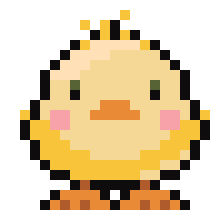
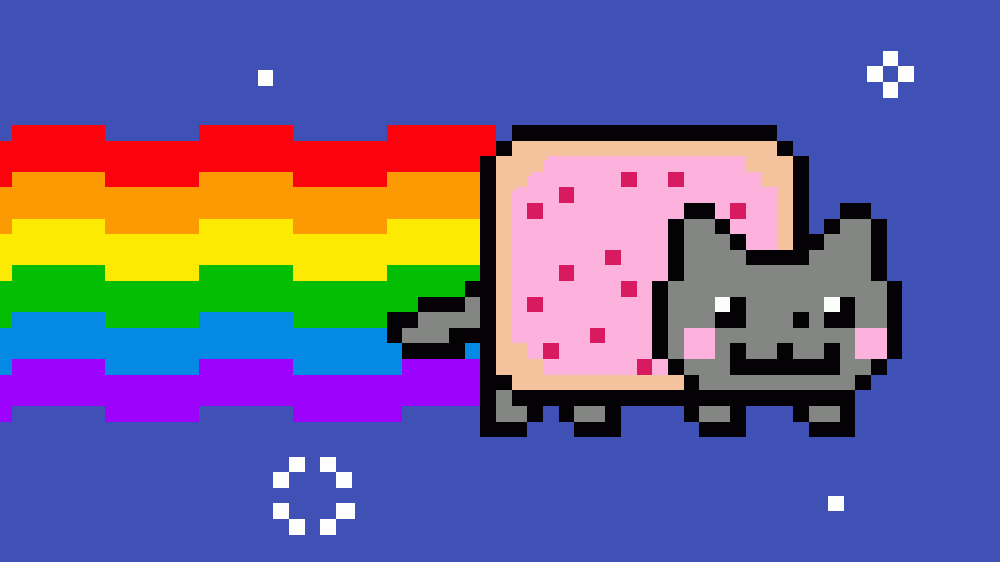

# 🪄 Creating GIFs with Python  

Had a lot of free time and was bored so decided to practice coding while creating something cool.
I’m learning Python and wanted to try something fun, so I made a project that turns normal images into animated GIFs 🎉.
With just a few lines of Python, you can load pictures, put them together, and save them as a GIF.

This is great if you’re just starting out with Python, image editing, or programming in general — because it’s fun, visual, and you get to see your code come to life as an animation ✨.

---

## ✨ Features  

- 🎨 Create animated GIFs from image sequences  
- 🐱 Examples included: **Nyan Cat, Dino, Chicklet, Hippocorn**  
- ⚡ Lightweight and beginner-friendly
- 🛠 Uses Python libraries: `imageio.v3` and `cv2(OpenCV)`, tho cv2 not actually used in this project.
- 🔄 Control frame duration, looping, and animation speed  

---

## 🎬 Example GIFs  

Here are some of the animated GIFs generated using this project. Each one is created by stitching together a sequence of individual frames with Python.  

| 🐥 Chicklet         | 🦖 Dino         | 🦄 Hippocorn         | 🌌 Nyan Cat         |
| ------------------- | --------------- | -------------------- | ------------------- |
|  |  |  |  |

---
